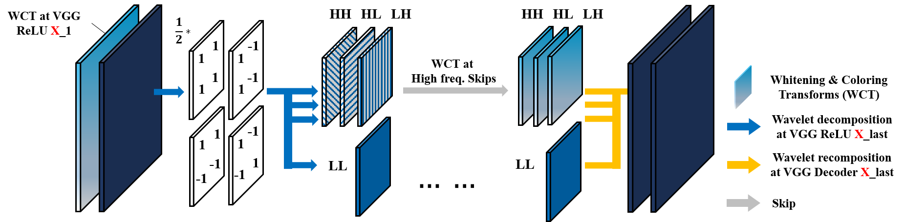
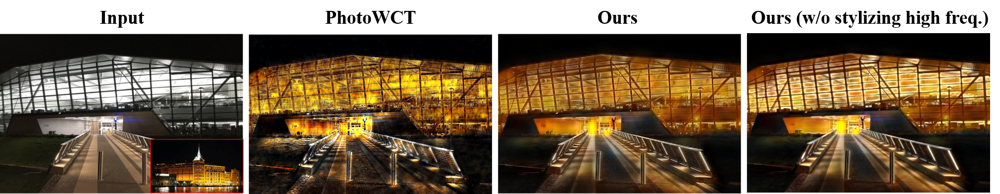

&nbsp;

&nbsp;


# WCT2 (ICCV 2019 accepted) 
Photorealistic Style Transfer via Wavelet Transforms | [paper](https://arxiv.org/abs/1903.09760) | [supplementary materials](https://github.com/clovaai/WCT2/blob/master/%5Bsupplementary%20materials%5D%20Photorealistic_Style_Transfer_via_Wavelet_Transforms.pdf) | [video stylization results](https://youtu.be/o-AgHt1VA30)

 [Jaejun Yoo](mailto:jaejun.yoo@navercorp.com)\*,  [Youngjung Uh](mailto:youngjung.uh@navercorp.com)\*, [Sanghyuk Chun](mailto:sanghyuk.c@navercorp.com)\*, [Byeonkyu Kang](mailto:lejkbk0930@gmail.com), [Jung-Woo Ha](mailto:jungwoo.ha@navercorp.com)
 
Clova AI Research, NAVER (* equal contributions)  
 
PyTorch implementation for photorealistic style transfer that does **not need any further post-processing steps**; e.g. from day to sunset, from summer to winter, etc. This is the first end-to-end model that can stylize 1024×1024 resolution image in 4.7 seconds, giving a pleasing and photorealistic quality without any post-processing.

The code was written by [Jaejun Yoo](https://github.com/jaejun-yoo) and [Byeongkyu Kang](https://github.com/KangBK0120).  
 

## Getting Started
### Dependency
- PyTorch >= 0.4.1
- Check the requirements.txt
```bash
pip install -r requirements.txt
```
### Installation
- Clone this repo:
```bash
git clone https://github.com/clovaai/WCT2.git
cd WCT2
```
* Pretrained models can be found in the `./model_checkpoints`

- Prepare image dataset
  - Images can be found in [DPST repo](https://github.com/luanfujun/deep-photo-styletransfer)
    - You can find the entire content and style images (with paired segmentation label maps) in the following link [DPST images](https://github.com/luanfujun/deep-photo-styletransfer/tree/master/examples).  **input** folder has the content images and the **style**  folder has the style images. Every segmention map can be found in the **segmentation** folder.
  - To make a new dataset with label pairs, please follow the instruction of [PhotoWCT repo](https://github.com/NVIDIA/FastPhotoStyle/blob/master/TUTORIAL.md)
  - Put the content and style images with their segment label pairs (if available) into the `example` folder accordingly. 
    - Currently there are several example images so that you can execute the code as soon as you clone this repo.  
- Finally, test the model:
```bash
python transfer.py --option_unpool cat5 -a --content ./examples/content --style ./examples/style --content_segment ./examples/content_segment --style_segment ./examples/style_segment/ --output ./outputs/ --verbose --image_size 512 
```

The test results will be saved to `./outputs` by default.  

### Arguments
* `--content`: FOLDER-PATH-TO-CONTENT-IMAGES
* `--content_segment`: FOLDER-PATH-TO-CONTENT-SEGMENT-LABEL-IMAGES
* `--style`: FOLDER-PATH-TO-STYLE-IMAGES
* `--style_segment`: FOLDER-PATH-TO-STYLE-SEGMENT-LABEL-IMAGES
* `--output`: FOLDER-PATH-TO-OUTPUT-IMAGES
* `--image_size`: output image size
* `--alpha`: alpha determines the blending ratio between content and stylized features
* `--option_unpool`: two versions of our model (sum, cat5)
* `-e`, `--transfer_at_encoder`: stylize at the encoder module
* `-d`, `--transfer_at_decoder`: stylize at the decoder module
* `-s`, `--transfer_at_skip`: stylize at the skipped high frequency components
* `-a`, `--transfer_all`: stylize and save for every composition; i.e. power set of \{-e,-d,-s\})
* `--cpu`: run on CPU
* `--verbose`


## Photorealistic Style Transfer
* DPST: "Deep Photo Style Transfer" | [Paper](https://arxiv.org/abs/1802.06474) | [Code](https://github.com/luanfujun/deep-photo-styletransfer)
* PhotoWCT: "A Closed-form Solution to Photorealistic Image Stylization" | [Paper](https://arxiv.org/abs/1703.07511) | [Code](https://github.com/NVIDIA/FastPhotoStyle)
* PhotoWCT (full): PhotoWCT + post processing
### Schematic illustration of our wavelet module
 

### Component-wise Stylization
* Only for `option_unpool = sum` version
* Full stylization
```bash
python transfer.py --option_unpool sum -e -s --content ./examples/content --style ./examples/style --content_segment ./examples/content_segment --style_segment ./examples/style_segment/ --output ./outputs/ --verbose --image_size 512
```
* Low-frequency-only stylization
```bash
python transfer.py --option_unpool sum -e --content ./examples/content --style ./examples/style --content_segment ./examples/content_segment --style_segment ./examples/style_segment/ --output ./outputs/ --verbose --image_size 512
```
 

### Results
* `option_unpool = cat5` version
```bash
python transfer.py --option_unpool cat5 -a --content ./examples/content --style ./examples/style --content_segment ./examples/content_segment --style_segment ./examples/style_segment/ --output ./outputs/ --verbose --image_size 512
```
 

## Acknowledgement
* Our implementation is highly inspired from NVIDIA's PhotoWCT [Code](https://github.com/NVIDIA/FastPhotoStyle).

## Citation
If you find this work useful for your research, please cite:
```
@inproceedings{yoo2019photorealistic,  
  title={Photorealistic Style Transfer via Wavelet Transforms},
  author={Yoo, Jaejun and Uh, Youngjung and Chun, Sanghyuk and Kang, Byeongkyu and Ha, Jung-Woo},
  booktitle = {International Conference on Computer Vision (ICCV)},
  year={2019}
}
```

## Contact
Feel free to contact me if there is any question (Jaejun Yoo jaejun.yoo@navercorp.com).

## License
Copyright (c) 2019 NAVER Corp.

Permission is hereby granted, free of charge, to any person obtaining a copy
of this software and associated documentation files (the "Software"), to deal
in the Software without restriction, including without limitation the rights
to use, copy, modify, merge, publish, distribute, sublicense, and/or sell
copies of the Software, and to permit persons to whom the Software is
furnished to do so, subject to the following conditions:

The above copyright notice and this permission notice shall be included in
all copies or substantial portions of the Software.

THE SOFTWARE IS PROVIDED "AS IS", WITHOUT WARRANTY OF ANY KIND, EXPRESS OR
IMPLIED, INCLUDING BUT NOT LIMITED TO THE WARRANTIES OF MERCHANTABILITY,
FITNESS FOR A PARTICULAR PURPOSE AND NONINFRINGEMENT.  IN NO EVENT SHALL THE
AUTHORS OR COPYRIGHT HOLDERS BE LIABLE FOR ANY CLAIM, DAMAGES OR OTHER
LIABILITY, WHETHER IN AN ACTION OF CONTRACT, TORT OR OTHERWISE, ARISING FROM,
OUT OF OR IN CONNECTION WITH THE SOFTWARE OR THE USE OR OTHER DEALINGS IN
THE SOFTWARE.
